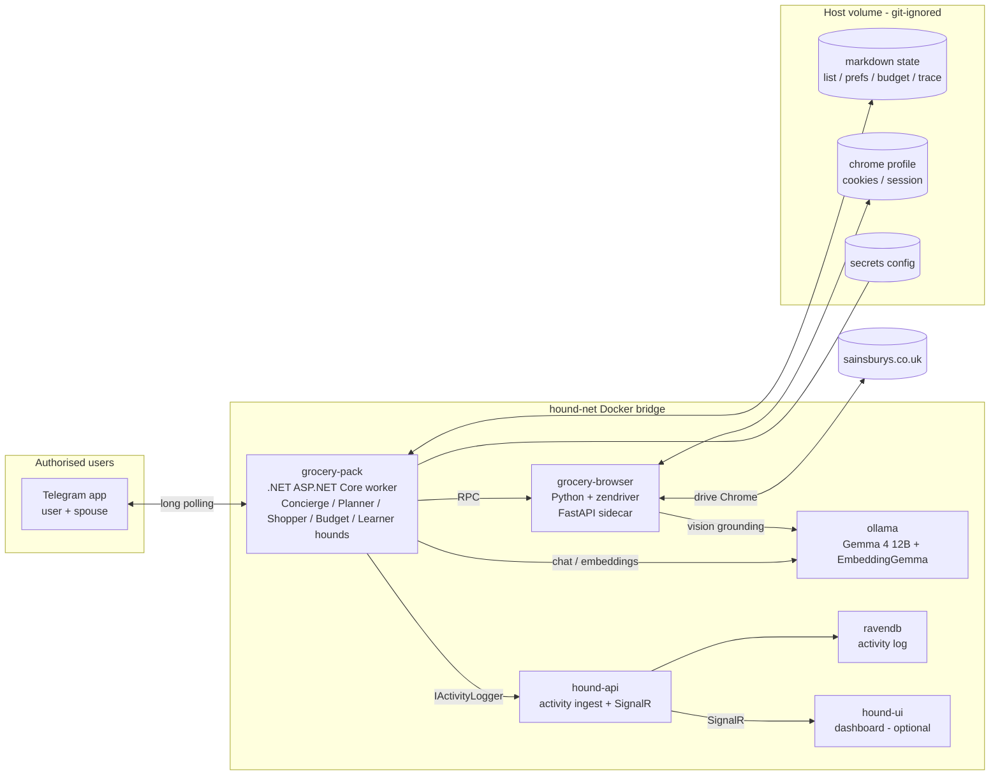
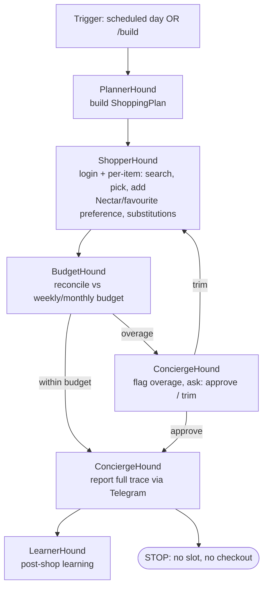

# Grocery Pack — Specification

> Status: **Draft spec for review** (no implementation yet). This document defines a new
> pack of hounds that automates weekly online grocery shopping at Sainsbury's. Use it as the
> instruction source when you ask Copilot to begin implementation.

---

## 1. Overview

The **Grocery Pack** is a new pack added to the existing Hound AI platform. Its goal is to
maintain a shared shopping list throughout the week and, on a set day, **build a basket of
groceries on the real Sainsbury's website** ready for the user to choose a delivery slot and
complete checkout themselves.

Two people (the user and their spouse) interact with the pack through a **Telegram bot persona**.
They add and remove items in natural language all week. On the scheduled "shop day" the pack logs
in to Sainsbury's, selects products honouring budget, Nectar (loyalty) prices and favourites,
adds them to the live basket, and reports a full trace back over Telegram — then **stops**.

It reuses the platform's existing infrastructure: **Docker Compose**, **Ollama** (local LLMs,
incl. a multimodal model), and **RavenDB** (activity logging). Durable working state
(shopping list, learned preferences, budget ledger, basket trace) lives in **local markdown
files**. Browser automation uses **[zendriver](https://github.com/cdpdriver/zendriver)** (a Python,
CDP-based, undetected Chrome driver) running as a sidecar service.

---

## 2. Goals & non-goals

### Goals
- Shared, conversational shopping list managed via Telegram by two users.
- Automatically build a Sainsbury's basket from a **loose** list, learning preferred products
  and typical quantities over time.
- Respect a **pay-cycle-anchored budget** (monthly + weekly with ±10% flex).
- Prefer **Nectar-priced** (loyalty discount) items and **favourites**.
- Produce a **full, auditable trace** of everything added to the basket.
- Keep all credentials out of git.

### Non-goals / hard exclusions
- **MUST NOT select a delivery slot.**
- **MUST NOT proceed to checkout or pay.**
- No purchasing decisions are finalised by the hound — the human always completes the order.
- Not a general-purpose web agent; scope is limited to Sainsbury's groceries.

---

## 3. Hard requirements (must-haves)

| # | Requirement |
|---|-------------|
| R1 | **Never select a delivery slot. Never check out. Never pay.** Enforced by an action allowlist + URL denylist in the browser worker (see §11.4). |
| R2 | **Rolling/pay-cycle monthly budget** set in config. Treated as a *soft* cap (the human controls checkout): the hound adds items, flags any projected overage, and asks via Telegram. |
| R3 | **Weekly budget with ±10% flex**, anchored to the pay cycle. Overage → add + flag + ask. |
| R4 | **Full trace** of every item added to the basket (product, price, Nectar/favourite flags, quantity, substitution reason, running total) in `basket-trace.md` **and** the RavenDB activity log. |
| R5 | **Prefer Nectar-priced items** (loyalty discount) when choosing between comparable products. |
| R6 | **Prefer favourites** (Sainsbury's account favourites + learned favourites). |
| R7 | Site is **Sainsbury's** (`https://www.sainsburys.co.uk/gol-ui/groceries`). |
| R8 | **Login credentials stored in a config file that is git-ignored.** No secrets committed. |
| R9 | All interaction/notification with the users happens over **Telegram** with a configurable persona. |

---

## 4. Users & persona

- **Two authorised users** (user + spouse), identified by Telegram chat/user IDs in config.
  Messages from any other ID are ignored.
- **Persona**: name is a **config item** (set later). Tone: **friendly, efficient, not overly
  talkative**. Confirms actions briefly, surfaces decisions that need a human, avoids chatter.
- Works in either a shared **group chat** or individual DMs (config: `Telegram:AllowedChatIds`).

---

## 5. Architecture

Reuses the existing platform; adds **one .NET pack** + **one Python browser sidecar** + a
**state volume**. Telegram uses **long polling** (no public webhook / no inbound ports → free,
fully local).



**Why a Python sidecar?** `zendriver` is Python-only. Keeping it as a thin sidecar lets the
.NET pack keep the platform's conventions (AF hounds, `IActivityLogger`, keyed Ollama clients,
graph orchestration) while the sidecar owns the undetected browser and vision-assisted scraping.

### 5.1 Container model & shared code (`Hound.Core`)

**Yes — the Grocery Pack runs in its own container(s), fully independent of `trading-pack`.**
This follows the platform's *one-container-per-pack* rule:

- **`grocery-pack`** — the .NET `Hound.Grocery` worker (its own image/process, exactly like
  `trading-pack`). Trading and grocery hounds **never share a process**.
- **`grocery-browser`** — the Python `zendriver` sidecar (second container).
- Both join the existing **`hound-net`** bridge and reuse the shared **infrastructure** services
  (`ollama`, `ravendb`, `hound-api` + SignalR, `hound-ui`). Those are shared *services*, not
  shared in-process state.

**How "common" is handled — compile-time, not runtime.** Shared code lives in the existing
**`Hound.Core` class library** and is consumed via a **`<ProjectReference>`**, the same way
`Hound.Trading` does it:

```xml
<!-- Hound.Grocery.csproj -->
<ProjectReference Include="..\Hound.Core\Hound.Core.csproj" />
```

`Hound.Grocery` reuses from `Hound.Core`: `IActivityLogger` / `HttpActivityLogger`,
`IOllamaClientFactory` / `OllamaClientFactory`, the logging helpers, and the base config-model
conventions. Each pack's Docker image **compiles its own copy** of `Hound.Core` in (the multi-stage
build copies `Hound.Core/` + the pack project, then `dotnet publish`). Consequences:

- Each container gets its **own instances** of these types and its **own** activity-logging HTTP
  client → **no shared mutable state** between packs; isolation is preserved.
- Cross-pack interaction happens **only** through shared backing services (RavenDB documents, the
  `hound-api`), never via in-memory coupling.
- **Caveat:** `Hound.Core` currently also contains trading-flavoured `MarketIntel` (news/sentiment)
  code. The grocery pack simply won't reference it — there's no forced coupling. If we want
  `Hound.Core` to stay strictly pack-agnostic we *could* later relocate `MarketIntel`, but that is
  **not required** for this work.
- The grocery pack's `Dockerfile` mirrors `src/Hound.Trading/Dockerfile` (copy `Hound.Core` +
  `Hound.Grocery`, restore, publish, `aspnet:9.0` runtime).

---

## 6. The hounds (pack composition)

Each hound is implemented as a graph node (mirrors `Hound.Trading`'s `INode` + `Config/*.json`
pattern) and registered as a singleton in `Program.cs`. Typed record DTOs live in
`Nodes/NodeModels.cs`.

| Hound | Responsibility | LLM | Key I/O |
|-------|----------------|-----|---------|
| **ConciergeHound** | Telegram front door + persona. Parses NL messages (add/remove/query/commands), updates `shopping-list.md`, relays notifications, runs the approval/trim conversation. | Gemma 4 (`default`) | in: Telegram updates; out: list mutations, user messages |
| **PlannerHound** | Turns the loose list into a concrete **shopping plan** (search terms, candidate products, target quantities) using learned preferences, favourites and budget guidance. | Gemma 4 (`default`, thinking mode) | in: list + prefs + budget; out: `ShoppingPlan` |
| **ShopperHound** | Drives the `grocery-browser` sidecar: login (session reuse), search, evaluate candidates (price, **Nectar**, **favourite**, stock), add to basket, **substitute** when unavailable. Vision-assisted grounding. | Gemma 4 (`vision`) | in: `ShoppingPlan`; out: `BasketResult` + per-item trace |
| **BudgetHound** | Maintains the pay-cycle **budget ledger**, computes weekly/monthly projected totals, applies ±10% weekly flex, flags overages and drives the flag-and-ask decision. | deterministic (+ light Gemma 4 for messaging) | in: `BasketResult`; out: `BudgetVerdict` |
| **LearnerHound** | The "Tuner" analog. Runs on a timer / after each shop. Refines learned product mappings, typical quantities, favourite weighting and dislikes from basket history, explicit user feedback and (optionally) the Sainsbury's order-history page. | Gemma 4 (`default`) + EmbeddingGemma | in: history + feedback; out: updated `preferences.md` |

> Naming follows the **Hound / Pack** convention. The pack name in code: **`Hound.Grocery`**;
> display name **"Grocery Pack"**.

---

## 7. Orchestration & workflow

Two flows, mirroring the platform's cyclic graph state-machine:

### 7.1 Continuous intake (always on)
`ConciergeHound` long-polls Telegram. For each authorised message it:
1. Classifies intent (add / remove / set-quantity / query / command / approval reply).
2. Mutates `shopping-list.md` and confirms briefly.
3. Answers queries ("what's on the list?", "how much have we spent this week?").

### 7.2 Scheduled basket build ("shop day")
Triggered on a configurable day/time **and** on-demand via `/build`.



Hard stop: the workflow ends with the basket populated. It **never** advances to slot selection
or checkout.

---

## 8. State files (markdown)

Stored on a git-ignored host volume (`grocery-data`), mounted into `grocery-pack`. All are
human-readable so both users can inspect/edit them directly.

| File | Purpose | Sketch |
|------|---------|--------|
| `shopping-list.md` | Current loose list. | `- [ ] milk  (qty: ~2)  ·  added by Carl 2026-06-21` |
| `preferences.md` | Learned product mappings, typical quantities, favourites, dislikes. | `milk → "Sainsbury's British Semi Skimmed Milk 2.27L" · usual qty 2 · confidence 0.8` |
| `budget-ledger.md` | Pay-cycle config snapshot + running weekly/monthly totals + history. | tables per cycle/week |
| `basket-trace.md` | Full audit of the latest build (R4). | per-item rows + running total + substitutions + links |
| `purchase-history.md` | Append-only log of past builds (and confirmed orders, if the user replies "ordered"). | feeds LearnerHound |

> Markdown is the **working store**; RavenDB remains the **activity/audit log** (via
> `IActivityLogger`). The two are complementary, not duplicative.

---

## 9. Budget model

- **Anchored to the pay cycle.** Config: `Budget:CycleStartDay` (day of month the cycle begins).
  Monthly budget = the cycle window from that day to the next cycle start.
- **Weekly budget** = derived within the cycle; config sets the weekly amount (or it's derived
  from the monthly amount across the cycle's weeks). **±10% flex** allowed per week.
- **Soft enforcement (per your decision):** because the human completes checkout, the hound:
  1. Adds the planned items.
  2. Computes projected weekly + monthly totals.
  3. If weekly exceeds +10%, or the cycle total exceeds the monthly cap → **flag the overage and
     ask** via Telegram (`approve` keeps it; `trim` drops lowest-priority/non-favourite,
     non-Nectar items until it fits, reporting what was dropped).
- **Ledger** updates after each build; reconciled against the actual basket subtotal scraped from
  Sainsbury's (source of truth for prices, incl. Nectar discounts).

Config (illustrative):
```jsonc
"Budget": {
  "Currency": "GBP",
  "CycleStartDay": 25,          // pay day
  "MonthlyCap": 600.00,
  "WeeklyTarget": 140.00,
  "WeeklyFlexPercent": 10,
  "OnOverage": "FlagAndAsk"     // add everything, flag, ask to approve/trim
}
```

---

## 10. Product selection & learning

1. **Loose list → candidates.** PlannerHound expands each loose item ("milk") into a search
   term + the learned preferred product (from `preferences.md`) and a target quantity.
2. **Ranking** of Sainsbury's search results (ShopperHound), in priority order:
   1. Learned preferred product / **favourite** match (R6).
   2. **Nectar-priced** items among comparable options (R5).
   3. Price / unit price.
   4. In stock.
3. **Quantity** comes from learned typical weekly quantities; refined by LearnerHound over time.
4. **Substitutions (per your decision):** if the preferred product is unavailable, ShopperHound
   **auto-substitutes the closest sensible match** (respecting preferences + Nectar) and reports
   every substitution via Telegram.
5. **Learning sources** (LearnerHound): items the hound added historically, explicit Telegram
   feedback ("we prefer the oat milk", "stop buying brand X"), and optionally the Sainsbury's
   **order-history page** for ground-truth purchases.
6. **No hard dietary rules** (per your decision) — preferences are all learned/soft.

---

## 11. Browser automation (zendriver sidecar)

### 11.1 Service
- New Python service **`grocery-browser`** (FastAPI), image built from `infra/grocery-browser/`.
- Uses **zendriver** to drive a real, undetected Chrome. Internal-only (no published ports); on
  `hound-net`.

### 11.2 Session & stealth
- **Persist the Chrome profile** (cookies/storage) to a git-ignored volume so logins are rare.
- Undetected CDP driver + human-like pacing (randomised delays, realistic navigation) to avoid
  bot detection. **2FA is not expected**; a Telegram OTP-relay fallback is included only as a
  safety net (ConciergeHound relays a code if Sainsbury's ever challenges).
- Headed Chrome under a virtual display (Xvfb) inside the container is preferred for stealth;
  headless-new is the fallback. (WSL2 GPU/display caveats noted in §16.)

### 11.3 RPC surface (illustrative)
The .NET ShopperHound calls mid-level operations; the sidecar owns DOM + vision:
```
POST /login                 -> ensures an authenticated session (reuses profile)
POST /search {term}         -> ranked candidate products (name, price, nectarPrice?, isFavourite, inStock, url, imgRef)
POST /add {productId, qty}  -> adds to basket; returns basket subtotal + line
GET  /basket                -> current basket lines + subtotal
GET  /order-history         -> recent orders (for learning)
GET  /screenshot {region?}  -> PNG for vision grounding / trace evidence
```

### 11.4 Safety interlocks (enforce R1)
- **URL denylist:** the sidecar refuses to navigate to any path containing checkout / payment /
  slot / book-delivery routes.
- **Action allowlist:** only `search`, `open product`, `set quantity`, `add to basket`,
  `read basket`, `read order history`, `screenshot` are permitted. No "proceed to checkout",
  "book slot", or "pay" controls may be clicked — assertion guards + tests cover this.
- **Kill switch / dry-run** flag to run end-to-end without mutating the live basket.

---

## 12. Local model recommendation — Gemma 4 (16 GB VRAM, RTX 4070 Ti Super)

**Decision: standardise on Google's Gemma 4 family.** `gemma4:12b` is multimodal (text + image),
**locally available on Ollama today**, and brings **native function-calling**, a **native `system`
role** (for the persona) and **configurable thinking modes** — exactly what the agentic hounds
need. Its vision/document-OCR is a large step up over Gemma 3 (e.g. OmniDocBench 1.5 edit-distance
~0.13 vs Gemma 3 27B's ~0.37; lower is better), which is what reads prices / Nectar badges / stock
labels off screenshots.

The pack has four model jobs:

- **A. Read/OCR + reason over screenshots** (prices, Nectar badges, names, stock) — the main vision
  job. With zendriver, most element location comes from the CDP/DOM, so this is OCR + verification
  rather than blind grounding.
- **B. Element grounding / click coordinates** — handled by zendriver's DOM/CDP; a dedicated vision
  grounder is only a fallback if the DOM is obfuscated.
- **C. Text reasoning** — Concierge (NL parsing/persona), Planner (loose list → plan), Budget,
  Learner.
- **D. Embeddings** — fuzzy "milk" → exact product matching and preference recall.

### Recommended setup

| Job | Model | Ollama tag | Notes |
|-----|-------|-----------|-------|
| **A + C (unified brain)** | **Gemma 4 12B (dense, multimodal)** | `gemma4:12b` | **Default.** One warm model for OCR/vision **and** text reasoning. ~8 GB at Q4 → co-resident with the embedder, no model swapping. Function-calling drives the browser-RPC tools; native `system` role carries the persona; thinking mode for Planner/Budget. |
| **D (embeddings)** | **EmbeddingGemma 300M** | `embeddinggemma` | Tiny (~0.3 GB). Product matching + preference memory. Same vendor family. |
| Quality swap-in | **Gemma 4 26B (MoE, 4B active)** | `gemma4:26b` | 26B-class quality at ~4B-active speed. ~15–16 GB at Q4 → essentially fills the card; run **solo** (no co-resident text model) when you want max quality for a build. |
| Voice option | **Gemma 4 E4B (edge, +audio)** | `gemma4:e4b` | Lightweight; adds **audio** if you later want voice notes over Telegram. |
| Heavy / cloud | Gemma 4 31B | `gemma4:31b` / `gemma4:31b-cloud` | Beyond 16 GB locally except with heavy offload; cloud tag available. |

**Keyed `IChatClient`** (mirrors the trading pack's `strategy`/`default` keys): register
**`vision`** and **`default`** both pointing at `gemma4:12b` (one model serves both), plus an
embeddings client for `embeddinggemma`. This keeps a single model resident and avoids Ollama
swap latency on 16 GB.

### Alternatives (only if Gemma 4 vision proves weak on Sainsbury's UI)
The job-B grounding fallback ladder, in case CDP/DOM grounding ever gets flaky and screenshots are
needed to locate elements:
- **Qwen2.5-VL 7B** (`qwen2.5vl:7b`) — proven-local, strong UI-element OCR/grounding.
- **Qwen3-VL 8B** — current SOTA for GUI/agentic vision; **cloud-first on Ollama today, local
  "soon"** (or run as GGUF in the Python sidecar). Re-check local availability at build time.
- **UI-TARS-1.5-7B** / **Holo1.5 (3B/7B)** — purpose-built coordinate/ScreenSpot grounders;
  ~4 GB at Q4. Wire in as a "find-and-click" helper only if required.

> Action: add `gemma4:12b` and `embeddinggemma` to `infra/ollama/pull-models.sh`
> (and `gemma4:26b` / `gemma4:e4b` if you want the swap-in / voice options).

---

## 13. Telegram bot

- **Library:** `Telegram.Bot` (.NET), **long polling** (no webhook, no inbound port → free).
- Lives in a hosted service inside `grocery-pack`, owned by ConciergeHound.
- **Auth:** only `Telegram:AllowedChatIds` may interact; everything else ignored.
- **Commands & NL** (illustrative):
  - Free text: "add 2 milk", "remove eggs", "we're out of bread".
  - `/list` — show current list. `/build` — build the basket now.
  - `/budget` — show weekly/monthly position. `/status` — last build summary.
  - `/approve` `/trim` — respond to an overage prompt. `/help`.
- **Notifications:** build started/finished, substitutions, overage prompts, errors, OTP relay
  (fallback only).
- **Persona** injected via a configurable system prompt (name + friendly/efficient tone).

---

## 14. Tracing & observability

- **RavenDB activity log** via `IActivityLogger` → `HttpActivityLogger` → `hound-api` → RavenDB →
  SignalR (existing flow). New grocery activity types (e.g. `ListUpdated`, `PlanBuilt`,
  `ItemAdded`, `Substituted`, `BudgetFlagged`, `BuildCompleted`).
- **`basket-trace.md`** mirrors R4 in human-readable form (per-item: product, qty, price,
  Nectar?, favourite?, substitution reason, running subtotal, product URL, screenshot ref).
- **Telegram** summary on completion.
- **Dashboard (optional/later):** a grocery page in `hound-ui` can subscribe to the same SignalR
  feed. Not required for v1 (primary trace = RavenDB + markdown + Telegram).

---

## 15. Configuration & secrets

- **Git-ignored secrets** (R8). Add explicit `.gitignore` entries for the grocery secrets and the
  state/profile volume, e.g.:
  ```
  # Grocery pack secrets & state
  src/Hound.Grocery/Config/secrets.grocery.json
  data/grocery/
  ```
- Secrets via **`.env`** (already git-ignored) and/or a git-ignored JSON, surfaced through
  `IOptions<T>`:
  - `Sainsburys:Username`, `Sainsburys:Password`
  - `Telegram:BotToken`, `Telegram:AllowedChatIds`, `Telegram:PersonaName`
  - `Budget:*` (see §9)
  - `Schedule:ShopDay`, `Schedule:ShopTime`
  - `Ollama:VisionModel` / `Ollama:DefaultModel` (both default to `gemma4:12b`),
    `Ollama:EmbeddingModel` (default `embeddinggemma`)
- Provide a committed **`.env.example`** / `secrets.grocery.example.json` with placeholders only.

---

## 16. Repo structure (new)

```
src/
  Hound.Grocery/                 # .NET pack (ASP.NET Core worker; mirrors Hound.Trading)
    Nodes/                       # ConciergeHound, PlannerHound, ShopperHound, BudgetHound, LearnerHound, NodeModels.cs
    Config/                      # *.json hound configs (+ git-ignored secrets.grocery.json)
    Graph/                       # GroceryGraph, GroceryGraphState (reuses INode/IStateStore)
    Services/                    # TelegramService, BrowserWorkerClient, BudgetLedgerService, StateFileService, LearnerHostedService
    Program.cs, Dockerfile, appsettings.json
  Hound.Grocery.Tests/           # MSTest + Moq
infra/
  grocery-browser/               # Python zendriver FastAPI sidecar (Dockerfile, requirements.txt, app/)
data/grocery/                    # git-ignored volume: markdown state + chrome profile
src/Hound.Eval/Scenarios/
  ConciergeHound/ PlannerHound/ ShopperHound/ BudgetHound/ LearnerHound/   # >=5 scenarios each
.github/instructions/grocery.instructions.md   # pack conventions (new)
```

WSL2 caveats: confirm Chrome/Chromium runs in the sidecar container (deps + Xvfb), and that
display/GPU isn't required for zendriver headed mode under WSL2 (headless-new fallback otherwise).

---

## 17. Evals & tests

- **Evals (≥5 per hound)** in `Hound.Eval/Scenarios/{HoundName}/`, validated with
  `dotnet run --project src/Hound.Eval -- --dry-run`. Add a dispatch case per hound and stubs
  (`StubBrowserWorker`, `StubTelegram`, `StubStateFiles`). Example coverage:
  - **ConciergeHound:** add/remove parsing, ambiguous message, query, **prompt-injection**
    (untrusted Telegram text), unauthorised sender.
  - **PlannerHound:** loose→concrete mapping, favourite preference, budget-aware trimming,
    unknown item, quantity from history.
  - **ShopperHound:** Nectar preferred over cheaper non-Nectar, favourite match, out-of-stock
    substitution, no sensible substitute, basket subtotal reconciliation.
  - **BudgetHound:** within budget, weekly +10% edge, weekly overage, monthly-cap overage, trim
    selection order.
  - **LearnerHound:** learn new mapping, reinforce favourite, apply dislike feedback,
    quantity refinement, conflicting signals.
- **Unit tests (MSTest + Moq):** hounds, services (budget math, state-file IO, browser-worker
  client), and **safety interlocks** (assert checkout/slot routes & controls are refused).

---

## 18. Docker & CI/CD

- **Compose:** add `grocery-pack` (.NET, like `trading-pack`) and `grocery-browser` (Python),
  both on `hound-net`; new `grocery-data` volume; `grocery-pack` depends on `grocery-browser`,
  `ollama`, `ravendb`. `grocery-browser` publishes no host ports.
- **Models:** extend `infra/ollama/pull-models.sh` with `gemma4:12b` (unified text+vision) and
  `embeddinggemma` (matching); optionally `gemma4:26b` / `gemma4:e4b`.
- **CI:** extend `build-and-push.yml` to build/test `Hound.Grocery` (+ `Hound.Grocery.Tests`) and
  build/push the `grocery-browser` image to GHCR; extend `eval.yml` to run grocery scenarios.

---

## 19. Risks & open items (to confirm before/at implementation)

| Item | Note |
|------|------|
| **Sainsbury's ToS / automation** | Browser automation of a logged-in account may breach Sainsbury's terms; bot-defence may still block. zendriver mitigates but doesn't guarantee. Accept risk knowingly. |
| **zendriver under WSL2** | Validate Chrome + (optional) Xvfb in-container; confirm headed vs headless-new behaviour. |
| **Order-history scraping for learning** | Confirm whether to scrape past orders, or learn only from basket builds + explicit feedback. |
| **Dashboard page** | Optional for v1 — confirm if wanted. |
| **Values to set in config later** | persona name, pay-cycle start day, monthly/weekly amounts, scheduled shop day/time, Telegram chat IDs, group vs DM. |

---

## 20. Acceptance criteria (v1)

1. Both authorised users add/remove items in natural language via Telegram all week; the list
   persists in `shopping-list.md`.
2. On the scheduled day (and via `/build`), the pack logs in to Sainsbury's (reusing a saved
   session), builds a basket from the loose list, preferring **favourites** then **Nectar** prices,
   choosing learned quantities, and auto-substituting unavailable items (reported).
3. The basket **never** reaches slot selection or checkout (verified by interlock tests).
4. Budget is tracked against the pay-cycle ledger; weekly/monthly overages are **flagged with an
   approve/trim prompt** over Telegram.
5. A **full trace** is available in `basket-trace.md` and the RavenDB activity log, and summarised
   over Telegram.
6. No secrets are committed; the build and evals pass
   (`dotnet build`, `dotnet test`, `Hound.Eval --dry-run`).

---

## 21. Suggested implementation phases

1. **Scaffold** `Hound.Grocery` pack + `grocery-browser` sidecar + compose wiring + state volume +
   gitignore/secrets. (No behaviour yet; health checks green.)
2. **ConciergeHound + Telegram** intake/persona + `shopping-list.md` round-trip.
3. **grocery-browser** RPC: login/session reuse, search, add-to-basket, basket read + **safety
   interlocks**.
4. **PlannerHound + ShopperHound**: loose→basket with Nectar/favourite ranking + substitutions +
   `basket-trace.md` + activity logging.
5. **BudgetHound**: pay-cycle ledger + flag-and-ask.
6. **LearnerHound**: preference/quantity learning loop.
7. **Evals + tests + CI** across all hounds; end-to-end dry run.
8. (Optional) dashboard page.
